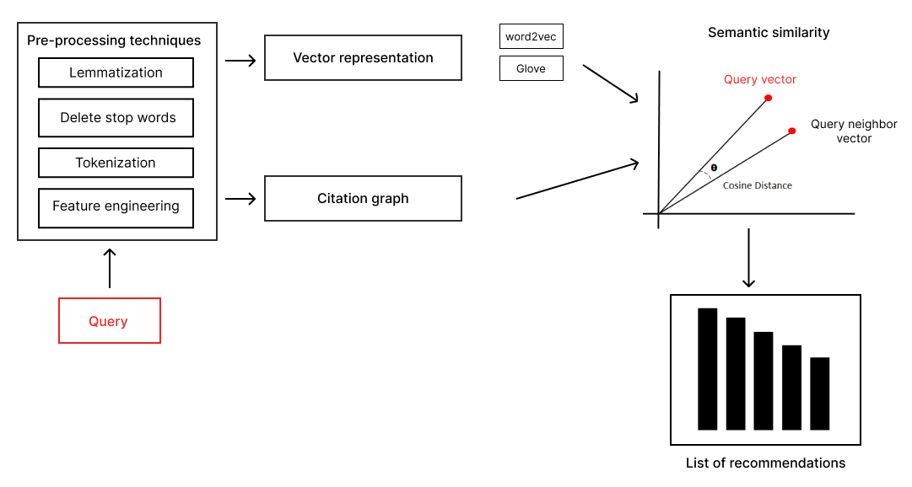
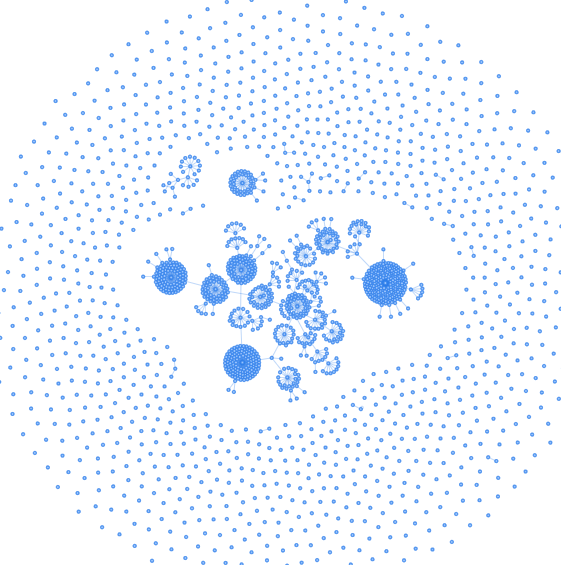

# Searticle | Article recommendation system

An algorithm for recommending scientific articles based on document citations using neural networks (Deep Learning) and natural language processing (NLP).

## How it works

For each user query (viewed article) , the following phases will be applied :

1. Text pre-processing techniques will be applied to ensure the relevance of data and to enhance the performance.

2. Each article in the database is represented by an embedding (numerical vector) calculated using two neural networks (transfer learning), so that the system understands the content of the article and what topic it talks about.

3. In parallel, a citation graph is created from the query's list of references.

4. As a last step, the cosine similarity metric is used to calculate the similarity between the query's embedding vector and the embeddings of all articles neighboring the query in the citation graph to return the most similar articles to the query as recommendations.

<p align="center">
  
</p>

The Algorithm uses transfer learning technique which combines **Glove** weights that is trained on 26GB text with 400k word vocabulary and 6 billion tokens with **Word2vec** network to return highly customized embeddings for articles. These embeddings are used then to determine the semantic similarity between the query and other articles.

## Citation graph

Each article in the corpus is represented by a list of metadata including a list of references, an embedding vector and a graph of citations. The citation graph is a graph where the nodes represent the documents and the edges are the citation relation between the documents.

The following figure represents citation network of first database (2k articles) :

<p align="center">
  
</p>

## Why this algorithm is better than traditional recommendation systems

The citation network allowed us to overcome the following limitations of traditional recommendation systems :

1. Reduce the space and time complexity of recommendation process, so instead of calculating the similarity between the query and all articles in the database, we only use the neighbors of the query in the citation graph.
2. The scalability problem in which the algorithm performed very well in both datasets used, so it is not affected by the amount of data.
3. The sparsity problem which results from a lack of information, so that users do not always vote on the articles viewed, which leads to poor evaluation then weak recommendations. However, it is overcome in this system through the citation network which uses a list of article references instead of user votes.
4. The cold start problem of recommendation based on collaborative filtering which does not represent any data to use at the beginning (no users, no votes therefore bad recommendations), but this is not the case in the Searticle system since it uses article references as the base for recommendations.

## Dataset (corpus)

The first dataset used contains more than 2k articles in json format. It has the following metadata (after pre-processing) :

<div align="center">

| Metadata | Type | Nullable ? |
| :---: | :---: | :---: |
| id | int | false |
| title | string | false |
| authors | string | false |
| link | string | true |
| references | array of strings | true |
| year | long | true |

</div>

The second corpus used is the Aminer dataset contains more than 3m articles in json format as well. It has the following metadata :

<div align="center">

| Metadata | Type | Nullable ? |
| :---: | :---: | :---: |
| id | string | false |
| abstract | string | true |
| authors | array of strings | true |
| n_citation | long | true |
| references | array of strings | true |
| title | string | true |
| venue | string | true |
| year | long | true |

</div>

**Notes :**

- You can download the first dataset from [here](https://mega.nz/folder/KUg1gRJS#EJSCyIQWCthBZNGh0K_-sw).
- You can download Aminer dataset from [here](https://mega.nz/folder/LJ4RHAqL#lKtwKPSrXqoFh4qO45O1iw).
- The data in the links above is data after pre-processing, but you can find its original source in the References section.

## Binary data

The algorithm needs deep learning model data to restore the model and run the algorithm. These data contains neural network parameters, including weights and biases.

You can download binary data for model of first dataset from [here](https://mega.nz/folder/WMYXHAwD#9NQDU2O9vuFj3VjGxh6NKw). You need only two binary files ```glove_w2v_embeddings.pkl``` and ```glove_knn_model.pkl```.

and the binary data for model of second dataset from [here](https://mega.nz/folder/vNpR0TxJ#fmtDxz-EtFmzYO0zJZ01nA).

**Important :** Without binary files, the algorithm cannot be executed, and they must be located inside the folder ```app/bin```.

## The website Searticle

Searticle is a small web application whose main purpose is to show the use of the citation-based recommendation system. It is built with the following stack:

- **Frontend** : HTML, CSS, JS, Bootstrap
- **Backend** : Flask
- **Database** : PostgreSQL
- **NLP and DL libraries** : SpaCy, Gensim, numpy, pandas, scikit-learn, PySpark (used for 2nd dataset only)

## Run the app

To run the app on your local machine, apply the following steps :

1. Clone the repo :

    ```git
    git clone https://github.com/YassouSr/searticle-articles-recommendation-system.git
    ```

2. Create an environment variable :

    ```cmd
    cd searticle-articles-recommendation-system
    python -m venv env  
    ```

3. Activate the environment and install packages listed in ```requirements.txt``` file :

    ```cmd
    .\env\Scripts\activate
    pip install -r requirements.txt 
    ```

4. Setup your database on PostgreSQL.
5. Create ```.env``` file in the root directory and write the following variables :

    ```md
    DATABASE_USERNAME=your_database_username_here
    DATABASE_PASSWORD=your_database_password_here
    DATABASE_HOST=your_database_host_here
    DATABASE_PORT=your_database_port_here
    DATABASE_NAME=your_database_name_here
    SECRET_KEY=random_secret_token_for_app
    EMAIL_SERVER=flask_mail_server_here
    EMAIL_PORT=flask_mail_port_here
    EMAIL_USE_SSL=flask_mail_ssl_here
    HOST_USER=your_email_address_here
    HOST_PASSWORD=password_to_use_third_party_access_to_email
    ```

    Note that I am using ```python-dotenv``` to manage secret data as environment variables for security reasons and to apply best practices. However, you're not obliged to setup the app like this, instead place your data directly inside ```app/__init__.py```.

6. Create app database schemas :

    ```cmd
    flask db stamp head
    flask db migrate
    flask db upgrade
    ```

7. Upload json data from previous links and extract the file inside the folder ```[ROOT_FOLDER]/data/```. If you've changed the file path, make sure to insert the new path inside ```load_json_to_postgre.py``` script.
8. Insert the json data to PostgreSQL (articles) by executing the following script (**important**) :

    ```cmd
    py load_json_to_postgre.py
    ```

    The above script must be executed after first migration *only* and must return no errors to make sure that articles are successfully uploaded to PostgreSQL.

9. Upload binary files from previous links and extract them inside the folder ```app/bin```. If you've changed the path, make sure to insert the new path inside ```recommender/config.py``` script.
10. Run the flask app :

    ```cmd
    py execute.py 
    ```

## Screenshots

The following are some screenshots for the web app :

[Landing page and registration](https://user-images.githubusercontent.com/37484871/218470326-bc313365-2414-4ef0-abd5-bf6ff1148505.mp4)

[Forget password functionality](https://user-images.githubusercontent.com/37484871/218470578-64f87866-521a-4813-bf3a-b82b43b3eb28.mp4)

[Account dashboard and main functionalities](https://user-images.githubusercontent.com/37484871/218474554-91601844-161c-43df-9c89-e4765fda9ee1.mp4)

[Responsivity](https://user-images.githubusercontent.com/37484871/218470899-d0ac9d6f-4590-47c8-ac0f-794ad0fc5a39.mp4)

## References

Some references that were helpful when building this project :

1. [Link to the original first dataset](https://github.com/SJ-palpa/curation_projet) (release v1.0).
2. [Link to the original second dataset](https://www.kaggle.com/datasets/kmader/aminer-academic-citation-dataset) (release v2.0).
3. Paul Resnick et Hal Varian. “Recommender systems”. T. 40. 1997, pp. 56-58.
4. F.O. Isinkaye, Y.O. Folajimi et B.A. Ojokoh. “Recommendation systems : principles, methods and evaluation”. 2015.
5. Marc Bertin et Jean-Pierre Descles. “Que nous apprennent les citations bibliographiques des articles scientifiques ? Une contribution linguistique à l’évaluation de la production scientifique”. Laboratoire LaLIC. Paris-Sorbonne, 2007.
6. Haifeng Liu et al. “Context-Based Collaborative Filtering for Citation Recommendation”. 1er octobre 2015.
7. Chandra Bhagavatula et al. “Content-Based Citation Recommendation”. 22 février 2018.
8. Kazunari Sugiyama et Min-Yen Kan. “A Comprehensive Evaluation of Scholarly Paper Recommendation Using Potential Citation Papers”. 1er juin 2015.
9. Trevor Strohman, Bruce Croft et David Jensen. “Recommending citations for academic papers”. In : Proceedings of the 30th Annual International ACM SIGIR Conference on Research and Development in Information Retrieval. 2007, pp. 705- 706.

## Releases

**Release v1.0** : includes basic website functionalities including :

- User registration
- Login
- Logout
- Forgot and reset password
- List articles with pagination
- Search for articles by title
- Compute and display recommendations for the article consulted

The small dataset has been used in this release for testing purposes only.

**Release v2.0** : upgrade the algorithm to use big data API Spark with Aminer dataset.
